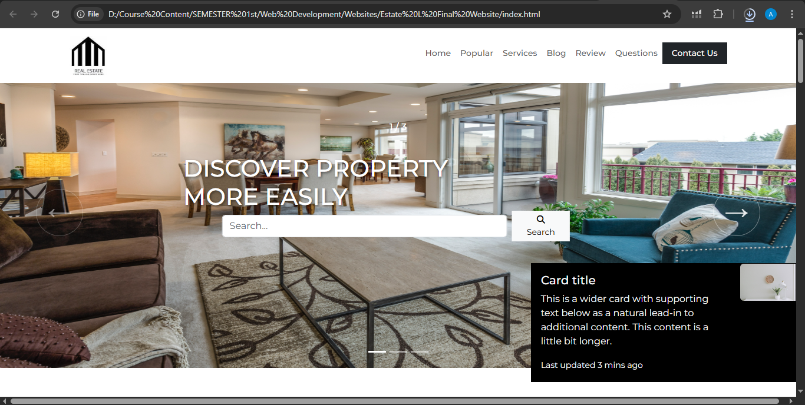

🙋‍♀️ About the Developer
Made with ❤️ by Ayesha Emaan, a Computer Science student and aspiring frontend/web developer from UET Lahore.
This project is part of my portfolio to demonstrate my frontend skills. Feedback and suggestions are welcome!

# 🏡 Real Estate Website

This is a modern, responsive **Real Estate Website** built using **HTML**, **CSS**, and **Bootstrap 5**. The project demonstrates frontend web development skills and includes various sections such as hero sliders, services, featured properties, testimonials, blog, FAQs, and a contact form with an embedded Google Map.

## 🌟 Features

- Fully responsive design
- Hero image slider with search bar
- Featured property cards with pricing
- Services section with visuals
- Blog section for housing updates
- Customer testimonials
- Frequently Asked Questions (FAQs) using Bootstrap Accordion
- Contact form with Google Map
- Footer with quick links and social icons

## 🛠️ Technologies Used

- HTML5
- CSS3 (with custom styles)
- Bootstrap 5.3
- Font Awesome 6 (for icons)
- Google Fonts (Montserrat)
- Google Maps (Embed API)

## 📁 Project Structure

├── index.html # Homepage
├── contact.html # Contact page
├── style.css # Custom styles
├── Images and logos (included in this repo)


## 📸 Screenshots

### 💻 Homepage



## 📌 How to Use

1. Clone or download the repository.
2. Make sure all images (like `house1.jpg`, `logo1.webp`, etc.) are available in your working directory.
3. Open `index.html` in a web browser to view the site.

```bash
git clone https://github.com/your-username/real-estate-website.git
cd real-estate-website
start index.html

📫 Contact
📧 Email: emaanayesha50@gmail.com
🔗 LinkedIn: https://www.linkedin.com/in/ayesha-emaan-1b5a1b295/

